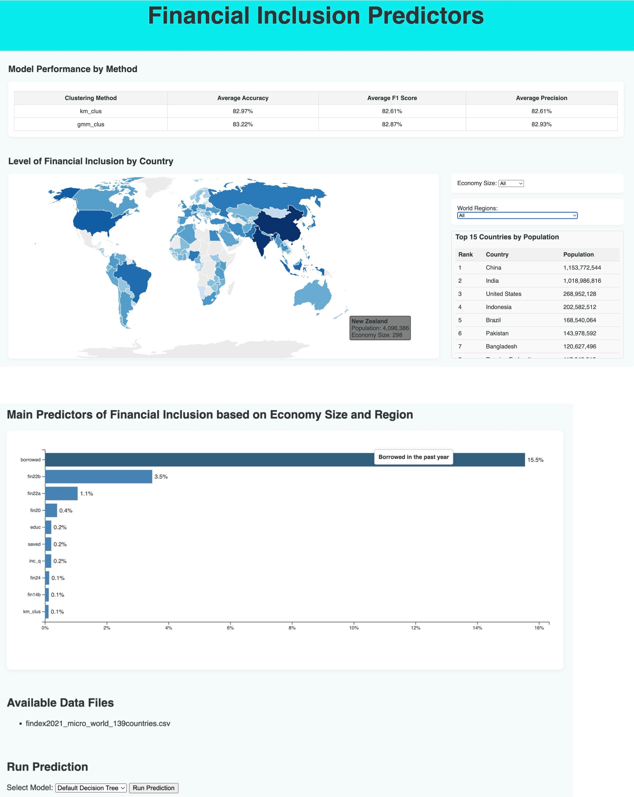

# Findex Vis

Findex Vis is a web application that visualizes machine learning model predictions on financial survey data. It features a FastAPI backend and an HTML/CSS/D3.js frontend. Machine learning outputs are generated onto mounted drive and made available for visualization.

## Project Overview

Data is retrieved from [WorldBank.org](https://www.worldbank.org/en/publication/globalfindex/Data).  

FastAPI Backend: Serves data and APIs for the frontend.
Frontend with D3.js: Interactive visualizations of ML model predictions.
Containerized Deployment: The entire application is containerized using Docker, ready for minikube dev deployment.

## Installation and Setup
Create a free account on [WorldBank.org](https://www.worldbank.org/en/publication/globalfindex/Data). and download the file shown in the picture below 


Rename the user_data folder in root to 'data' and 
Download/copy data into the ./data/ folder and ensure that these files are present:
```bash
Before running anything make sure you have docker and minikube installed and working.
You can check if they are installed by running these commands:
docker info
minikube -version

docker ps
minikube start --driver=docker 
cd findex_vis
mv user_data/* data/*
ls -l 
findex2021_micro_world_139countries.csv (File from World Bank)
ft2verbose.json
world_countries.json

On Windows, at root folder findex_vis/
deploy_win.bat

On MacOS, at the root folder findex_vis/
sh deploy_mac.sh

The script will run and spin up multiple terminals to run the app and also launch the dashboard. 

Scroll down on the dashboard to the bottom and choose Default Decision Tree and click prediction 
This will run the model and generate the files needed by the dashboard
Once this process is done you can refresh the screen and the fields should populate now.

The dashboard requires these files to be present in the /data in the root level to work correctly 
1) ft2verbose.json
2) world_countries.json
3) metrics_by_cluster.json
4) metrics_by_countries.json

```
## Dashboard 



## Helpful Commands and resources
```bash
kubectl logs -l app=mlapi
kubectl logs -l app=flask-app
kubectl get pods
kubectl get services
kubectl describe pod <pod-name> #see why pod is failing outward
kubectl logs <pod-name> #see why pod fail inward
kubectl logs deployment/mlapi -f
```

## Important Links and Resources 

Docker : https://docs.docker.com/get-started/

MiniKube: https://minikube.sigs.k8s.io/docs/start/?arch=%2Fmacos%2Farm64%2Fstable%2Fbinary+download

